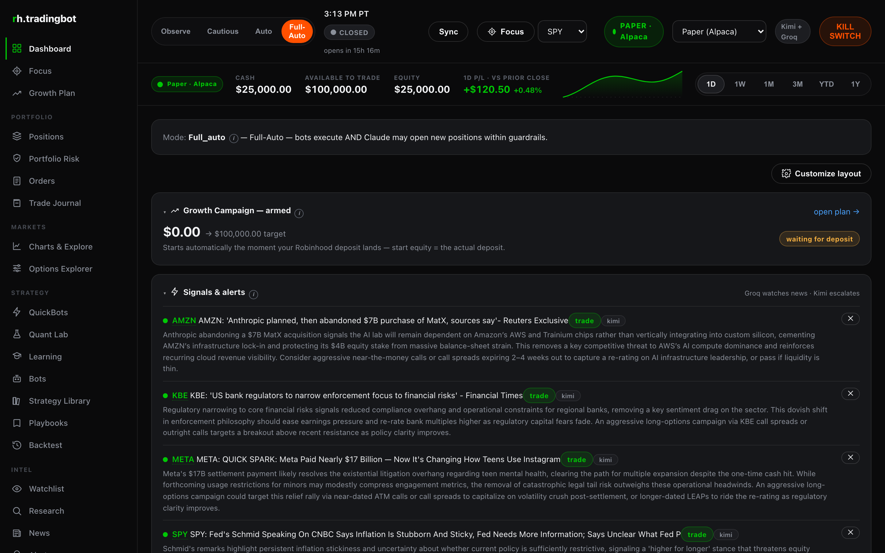
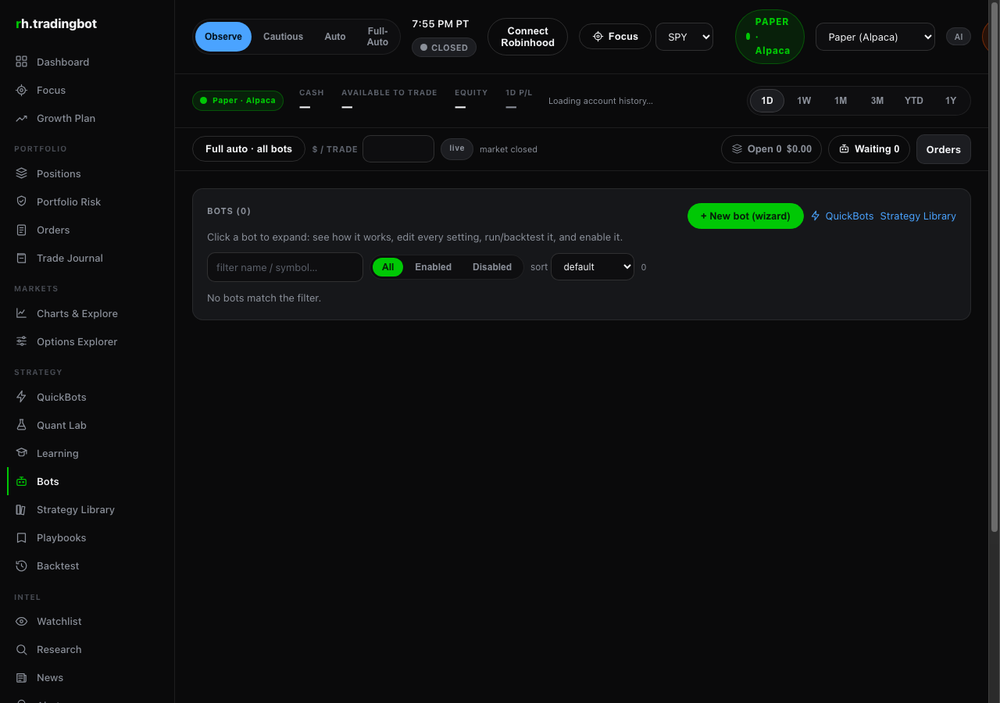

# fox-trader

Paper trading desk for **Fox · Trading** — a local dashboard and bot platform (Node 22 / TypeScript / Fastify + React) mirrored for public use.

- **Broker default:** Alpaca paper (`alpaca_paper`) until explicitly flipped in-app
- **Caps triad:** `$10k` max position / `50%` concentration / `50%` daily-loss
- **Swing defaults:** never 0DTE; 2–14 DTE; cut losers −10%; trail +10% with breakeven lock; soft TP 25%
- **Mode:** `full_auto` for watched paper sessions (start in `observe` if new)
- **Secrets:** keys, broker OAuth token stores, and personal account files stay gitignored — never commit them

Replaces `erichers/rh-trader` as the Fox desk home going forward.

## Quick links

- Setup: [`docs/SETUP.md`](docs/SETUP.md) — ports `8011` / `8888`, `desk-up.sh`, caps, run without secrets
- Security notes: [`docs/SECURITY.md`](docs/SECURITY.md)
- Screenshots: [`docs/screenshots/`](docs/screenshots/)





## Read this before you run it

> **This software can place real orders with real money** if you connect a live broker and leave paper mode. Trading equities and options can lose money.
>
> **No warranty.** MIT license. Not financial advice. Backtests do not predict future returns.
>
> **Start in paper.** Defaults: `alpaca_paper`, hard caps above. Watch the journal before trusting automation.

## One-command Mac desk

```bash
git clone https://github.com/erichers/fox-trader.git
cd fox-trader
cp .env.example .env   # add your Alpaca *paper* keys locally
(cd backend && npm install) && (cd frontend && npm install)
./scripts/desk-up.sh
```

Then open `http://127.0.0.1:8011/` (optional Apache on `:8888`).

## What stays out of git

`.env`, OAuth token JSON, DB dumps, `node_modules`, build `dist/`, personal notes, and anything matching the hardened [`.gitignore`](.gitignore).

## License

MIT — see [`LICENSE`](LICENSE).
